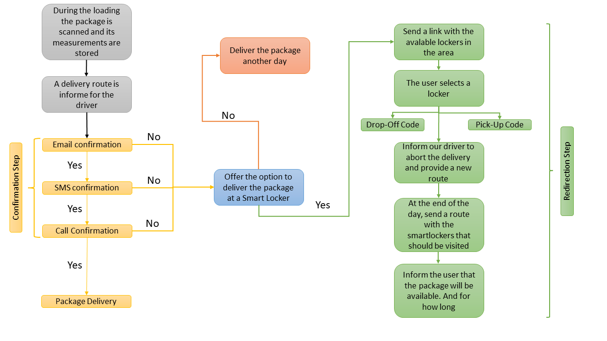

# Sustainable Supply Chain DeepHack

## Transatlantic AI Hackathon - ULTRAHACK

[Ideas](https://docs.google.com/document/d/1BjOzDVyPdYw4VCrMpDJSqaygSjmlmXd4kGMiTXUDkdo/edit) [Pitch](LINK)

## Project Name

Our project uses artificial intelligence, smart lockers, and optimization algorithms to solve the problem of last-mile product deliveries.

## Team:

[Armando Dauer](https://github.com/ArmandoDauer) (Back-end developer, Transportation specialist) \
[Jovial Tchatchum](https://github.com/aj52izov) (Back-end developer) \
[Matheus Correia](https://github.com/matheusgomesms) (Producer, Business Advisor, Transportation specialist) \
[Neha Deshpande](https://github.com/Neha-2) (Designer, UX/UI) \
[Paul Haggard](https://github.com/) (Business Advisor) \
[Tiago Tamagusko](https://github.com/tamagusko) (Back-end developer, Transportation specialist)

## Concept

There is a real last-mile delivery problem for retailers and logistics companies. Consumers want fast delivery at a low cost. Margins are shallow, and costs are only increasing, especially with the recent rise in fuel prices.
Optimized routes are no longer enough to solve delivery problems. Our proposal intends to combine routing, scheduling, and confirmation algorithms. Also, we will work with the help of smart lockers to avoid missed deliveries. Below is the diagram of our proposal:

Therefore, the user can receive it at home or in a smart locker. Slots are available outside of peak traffic hours for home delivery, thus avoiding deliveries at busy times. Still, one hour before the scheduled delivery, you receive an SMS to confirm the delivery in the option to receive at home. Also, 15 minutes before delivery, the user gets a call that will use an NLP algorithm to inform that delivery is approaching, request confirmation, and inform the documents necessary to receive the product. If the user cannot receive the product, that item is directed to the nearest closet.
Finally, the Luxonis OAK-D-Lite Spatial AI camera will be used to identify the dimensions of deliveries and direct them to fit the available cabinets with these measurements.

### AI Features

- NLP confirmation algorithm;
- Computer vision box measurements;
- Smart route management with real-time update.

## MVP

What have we done?

---

Codes and data are protected. Please see [LICENSE](LICENSE) for details.
