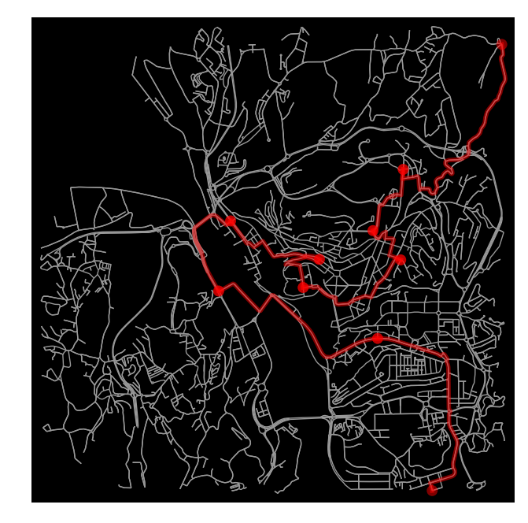

# A Multi-Objective Approach for Avoiding Multiple Delivery Attempts

## Transatlantic AI Hackathon - ULTRAHACK

## Sustainable Supply Chain DeepHack

Our project uses artificial intelligence, smart lockers, and optimization algorithms to solve the problem of last-mile product deliveries.

## Team 01:

[Armando Dauer](https://github.com/ArmandoDauer) (Back-end developer, Transportation specialist) \
[Jovial Tchatchum](https://github.com/aj52izov) (Back-end developer) \
[Matheus Correia](https://github.com/matheusgomesms) (Producer, Business Advisor, Transportation specialist) \
[Neha Deshpande](https://github.com/Neha-2) (Designer, UX/UI) \
[Paul Haggard](https://github.com/) (Business Advisor) \
[Tiago Tamagusko](https://github.com/tamagusko) (Back-end developer, Transportation specialist)

## Concept

There is a real last-mile delivery problem for retailers and logistics companies. Consumers want fast delivery at a low cost. Margins are shallow, and costs are only increasing, especially with the recent rise in fuel prices.
Optimized routes are no longer enough to solve delivery problems. Our proposal intends to combine routing, scheduling, and confirmation algorithms. Also, we will work with the help of smart lockers to avoid missed deliveries. Below is the diagram of our proposal:

Therefore, the user can receive it at home or in a smart locker. Slots are available outside of peak traffic hours for home delivery, thus avoiding deliveries at busy times. Still, one hour before the scheduled delivery, you receive an SMS to confirm the delivery in the option to receive at home. Also, 15 minutes before delivery, the user gets a call that will use an NLP algorithm to inform that delivery is approaching, request confirmation, and inform the documents necessary to receive the product. If the user cannot receive the product, that item is directed to the nearest closet.
Finally, the Luxonis OAK-D-Lite Spatial AI camera will be used to identify the dimensions of deliveries and direct them to fit the available cabinets with these measurements.

### Features

- Intelligent delivery confirmation and redirection system;
- Computer vision box measurements;
- Smart route management with real-time update.

## MVP

This MVP was generated for 10 deliveries in the city of Coimbra, Portugal. The inputs were just the 10 customer addresses. And with it it was possible to calculate the best route based on travel times.

To develop this MVP it was necessary:

1. Enter the address of the 10 customers. They were converted to coordinates using the geocoder function of OpenStreetMaps (Nominatim). Function: [coordinates.py](https://github.com/tamagusko/ai-transatlantic-hackathon/blob/main/src/coordinates.py) and [processingData.py](https://github.com/tamagusko/ai-transatlantic-hackathon/blob/main/src/processingData.py)
2. Using [OSMnx](https://osmnx.readthedocs.io/en/stable/) a basemap was created with information from OpenStreetMaps (OSM). Function: [createGraph.py](https://github.com/tamagusko/ai-transatlantic-hackathon/blob/main/src/createGraph.py). In this example, the graph was created with the centroid in the city of Coimbra, Portugal, with a 3 km radius and with the city's road network.
3. A distance matrix based on travel times was created. It was generated based on the length of the routes with the shortest travel time among all delivery locations in the network. Function: [createInstance.py](https://github.com/tamagusko/ai-transatlantic-hackathon/blob/main/src/createInstance.py) and [shortestRoute.py](https://github.com/tamagusko/ai-transatlantic-hackathon/blob/main/src/shortestRoute.py)
4. With this matrix with the distances of all the routes between deliveries, a genetic algorithm was executed to find a good solution to the problem. Function: [genAlgorithmBestRoute.py](https://github.com/tamagusko/ai-transatlantic-hackathon/blob/main/src/genAlgorithmBestRoute.py)
5. The final graph was generated over the network generated with one of the best solutions found. Function: [plotRoute.py](https://github.com/tamagusko/ai-transatlantic-hackathon/blob/main/src/plotRoute.py)

This route can be built with any combination of addresses that can be found in OSM. And the routes, travel times, and the availability of the roads depend only on the quality of the information present in the OSM.

---

Codes and data are protected. Please see [LICENSE](LICENSE) for details.

