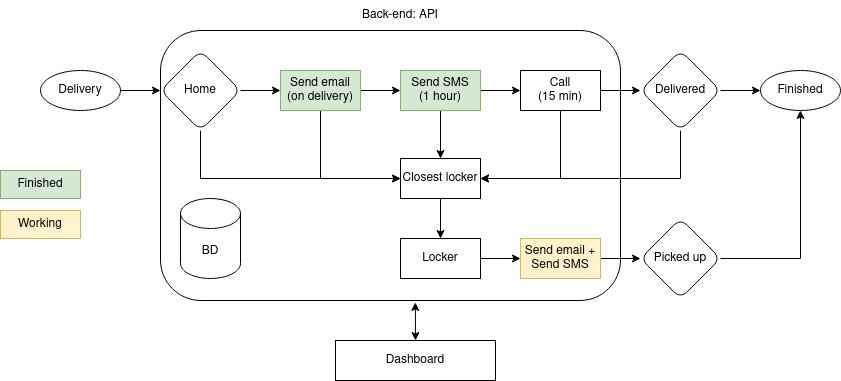

# MVP

This MVP has to prove that our idea can be applied in the future. Therefore, we have to prove the adopted concepts. If possible with real tests on a reduced scale.

## Definitions

- Use API modules developed in Python (FastAPI) to facilitate integration.
	1. sendSMS.py: Sends an sms using Twilio API.
	2. monitor.py: If the client's response is no(n) to an SMS or call, it directs the order to a locker closer to the customer.
	3. sendMail.py: send an email notifying of day delivery (sends when it leaves the warehouse).
	4. makeCall.py: 15 minutes before delivery, call the customer and ask if he can receive the order, answer y or n. In the future identify the client response with nlp.
	5. coordinates.py: with an address returns the coordinates (lat and long).
	6. closestLocker.py: with the coordinates, it returns the closest available locker (you have to evaluate the size of the order).
	7. optimalRoute.py: Optimization algorithm with metaheuristic to calculate the best route for deliveries. This algorithm updates whenever it has a response from the client.
	8. boxMeasurement.py: Using the Luxonis camera, take the measurements of the box. Using the luxonis camera, take the measurements of the box. This will be done at the warehouse.
	9. Plot Graph Results: Develop createGraph.py and plotRoute.py to show the routes created based on the optimization algorithm.
	9. Front-end:
	- Develop a frontend with a table of deliveries and status. Clicking on the delivery opens its details.
	- Develop a map to view locations, deliveries, and lockers.

## Activities:

1. ~~Create a data structure for the MVP.~~ @tamagusko: data/README.md
2. ~~Draw solution diagram.~~ @tamagusko
3. Fix concept diagram. @ArmandoDauer
4. Frontend draft - Dashboard (js - React). @Neha
5. Code boxMeasurement.py.
6. ~~First pitch (20220419 - 17H).~~ @ArmandoDauer
7. Write optimization algorithm (optimalRoute.py). @ArmandoDauer
8. ~~Code sendSMS.py.~~ @tamagusko
9. Code monitor.py @tamagusko (working)
10. ~~Code sendMail.py~~ @tamagusko
11. ~~Code makeCall.py.~~ @tamagusko
12. ~~code coordinates.py.~~ @tamagusko
13. code closestLocker.py. @tamagusko
14. ~~Plot graph results (createGraph.py + plotRoute.py).~~ @tamagusko
15. Integrate all modules on the front-end
16. First pitch
17. Finalize the MVP to present (until 24/02 8h).

