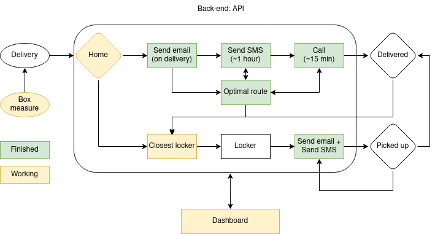

# MVP

This MVP has to prove that our idea can be applied in the future. Therefore, we have to prove the adopted concepts. If possible with real tests on a reduced scale.

## Definitions

- Use API modules developed in Python (FastAPI) to facilitate integration.
	1. sendSMS.py: Sends an sms using Twilio API.
	2. systemSMS: sends sms to client informing them of delivery within one hour. Asks if she/he is at home, customer answer: y or n. If the client answers something other than yes (y) or not (n) it sends another message saying that the format is just y or n.
	3. sendMail.py: send an email notifying of day delivery (sends when it leaves the warehouse).
	4. makeCall.py: 15 minutes before delivery, call the customer and ask if he can receive the order, answer y or n. In the future identify the client response with nlp.
	5. coordinates.py: with an address returns the coordinates (lat and long).
	6. closestLocker.py: with the coordinates, it returns the closest available locker (you have to evaluate the size of the order).
	7. boxMeasurement.py: Using the luxonis camera, take the measurements of the box. Using the luxonis camera, take the measurements of the box. This will be done at the warehouse.
- Develop a frontend with a table of deliveries and status. Clicking on the delivery opens its details.
	+ Javascript?
- Develop a map to simulate locations / deliveries / lockers?
	+ Lets do this?

## Activities:

1. ~~Create a data structure for the MVP.~~ @tamagusko: data/README.md
2. Draw solution diagram. @tamgusko
3. Fix concept diagram. @ArmandoDauer
4. Frontend draft (? js).
5. Code boxMeasurement.py.
6. First pitch (20220419 - 17H). Use this MVP docs. @ArmandoDauer and @matheusgomesms
7. Write optimization algorithm. @ArmandoDauer
8. ~~Code sendSMS.py.~~ @tamagusko
9. Code systemSMS.py @tamagusko
10. ~~Code sendMail.py~~ @tamagusko
11. Code makeCall.py.
12. code coordinates.py. @tamagusko
13. code closestLocker.py.

